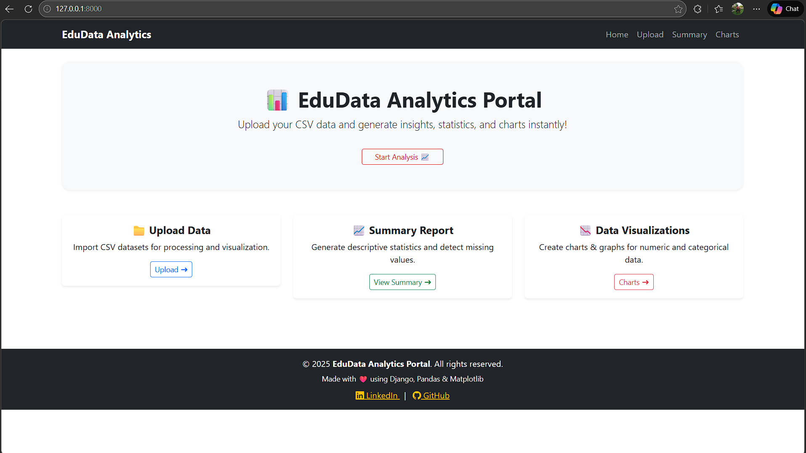
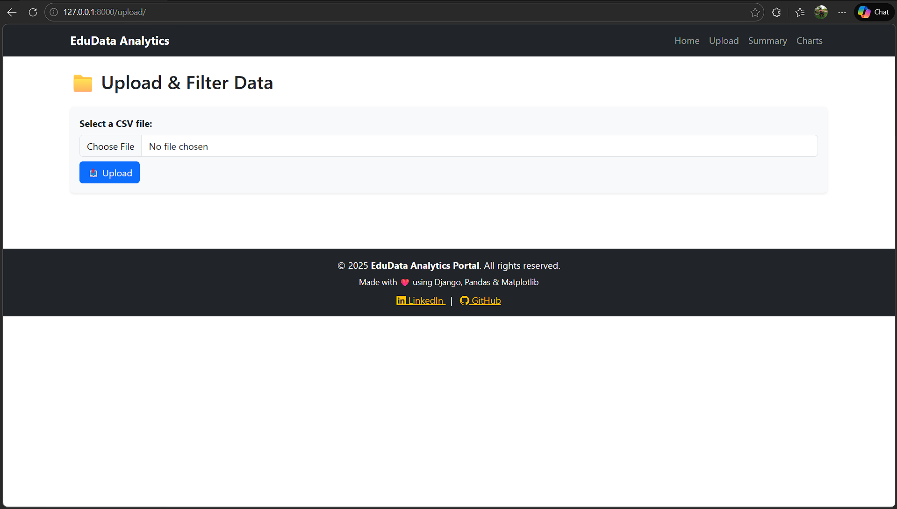
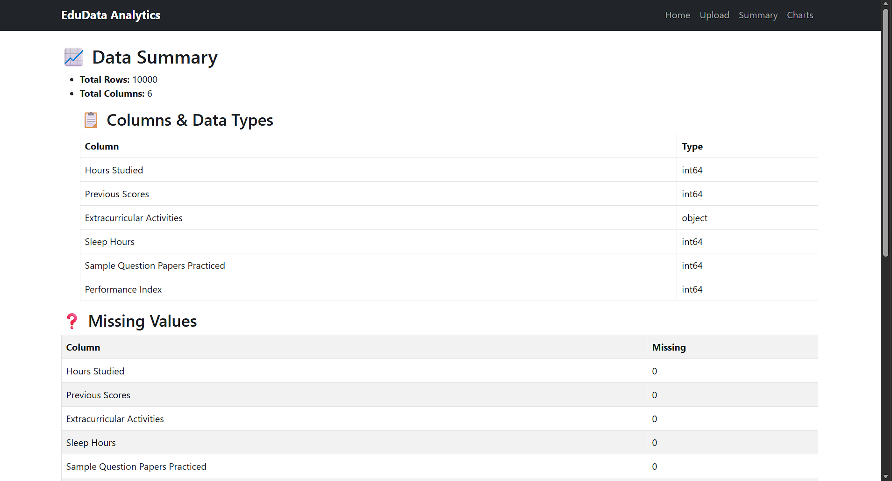
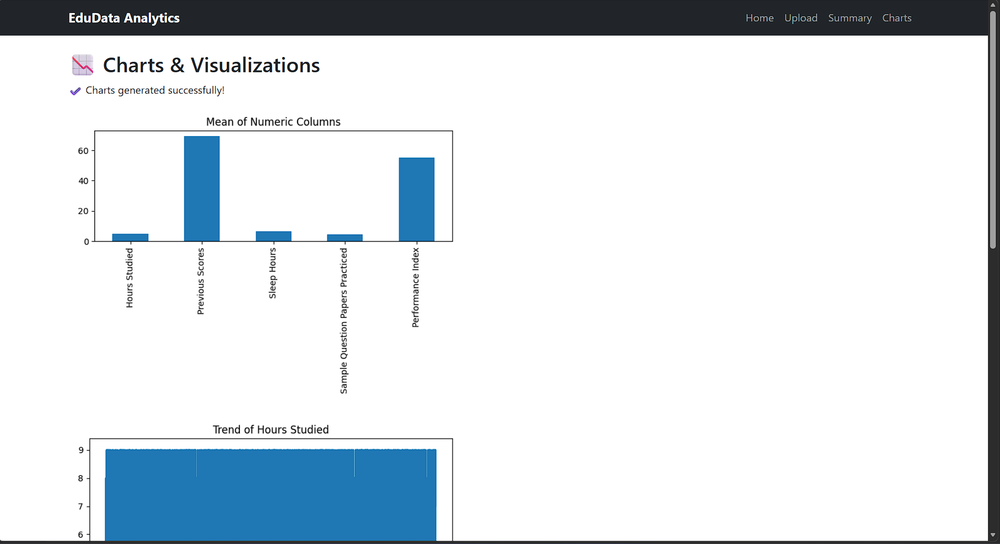

---

# 📊 **EduData Analytics Portal**

A Django-based Data Analytics Web Application that allows users to upload **CSV or Excel (.xlsx)** files, preview data, filter records, generate summary statistics, and visualize insights with charts — all in the browser.

🚀 **Technologies Used:** Django, Pandas, NumPy, Matplotlib, Bootstrap

---

## 🧠 **Features**

| Feature             | Description                                     |
| ------------------- | ----------------------------------------------- |
| 📁 File Upload      | Supports `.csv`, `.xlsx`, `.xls`                |
| 👀 Data Preview     | Displays first 5 rows after upload              |
| 🔍 Filter/Search    | Filter data by column + keyword                 |
| 📤 Export Data      | Export filtered data as CSV & Excel             |
| 📈 Summary Insights | Total rows, columns, missing values, data types |
| 📊 Visual Charts    | Bar, Line & Pie charts (Matplotlib)             |
| 🧹 Clear Upload     | Remove loaded dataset to restart                |
| 📱 Responsive UI    | Bootstrap 5 for clean design                    |

---
## 📸 Screenshots

### 🏠 Dashboard


### 📁 Data Upload Page


### 📈 Data Summary


### 📊 Chart Visualizations

---

## 🏗️ **Project Structure**

```
EduData Analytics Portal/
│
├── datadashboard/
│   ├── settings.py
│   ├── urls.py
│   ├── ...
│
├── analytics/                # Main App
│   ├── views.py
│   ├── urls.py
│   ├── templates/analytics/
│   │   ├── dashboard.html
│   │   ├── upload.html
│   │   ├── summary.html
│   │   └── charts.html
│
├── media/
│   └── charts/               # Saved Charts
│
├── templates/
│   ├── base.html
│   ├── navbar.html
│   └── footer.html
│
└── manage.py
```

---

## ⚙️ **Installation & Setup**

### 1️⃣ Clone the repository

```bash
git clone https://github.com/your-username/edudata-analytics-portal.git
cd edudata-analytics-portal
```

### 2️⃣ Create Virtual Environment (optional but recommended)

```bash
python -m venv env
source env/bin/activate   # Mac / Linux
env\Scripts\activate      # Windows
```

### 3️⃣ Install required packages

```bash
pip install django pandas numpy matplotlib openpyxl xlrd
```

### 4️⃣ Run Migrations

```bash
python manage.py migrate
```

### 5️⃣ Start Server

```bash
python manage.py runserver
```

---

## 🚀 **How to Use**

1. Open in browser → `http://127.0.0.1:8000/`
2. Click **Upload Data**
3. Select CSV / Excel file
4. Preview data in table
5. Filter by selecting a column + text
6. Export filtered results if needed
7. Click **View Summary** to see:

   * Data types
   * Missing values
   * Statistics table
8. Click **Charts** to view:

   * Bar, Line, Pie chart visualizations
9. Use **Clear Upload** to reset

---

## 📈 **Charts & Visualizations**

| Chart      | Purpose                            |
| ---------- | ---------------------------------- |
| Bar Chart  | Mean comparison of numeric columns |
| Line Chart | Trend of first numeric column      |
| Pie Chart  | Top 5 category frequencies         |

All charts are generated using **Matplotlib** and automatically saved to:

```
/media/charts/
```

---

## 📄 **Export Options**

| Format        | Command                    |
| ------------- | -------------------------- |
| CSV           | Built-in Pandas `to_csv()` |
| Excel (.xlsx) | Uses `openpyxl`            |
| Excel (.xls)  | Uses `xlrd`                |

---

## 🎯 **Future Enhancements**

* Machine Learning prediction module
* Multi-column filtering (AND/OR conditions)
* PDF report generation
* Deploy on Render / PythonAnywhere
* Drag & drop file upload
* User authentication & saved sessions

---

## 🤝 Contributing

Pull requests are welcome!
For major changes, please open an issue first to discuss what you'd like to update.

---

## ⭐ **Support the Project**

If you like this project, please **give it a star ⭐ on GitHub** — it helps a lot!

```
⭐ Star this repo — it motivates continued development!
```

---

# 🏁 **Conclusion**

This project bridges **Data Science + Web Development**, enabling real-time analytics without needing Excel or programming.
It serves as a practical example of how Django and Pandas can solve real-world problems.

---

